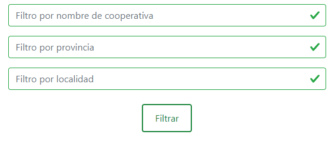
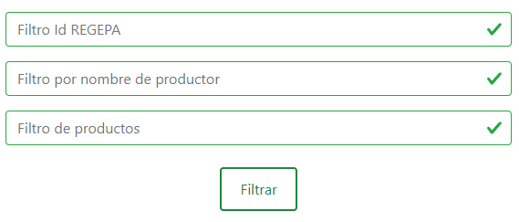
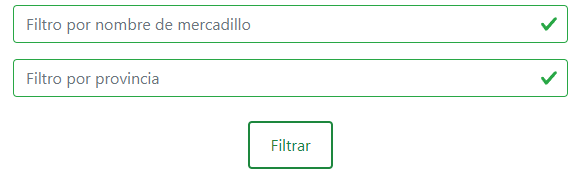

# AGROENLAZADOS

## Descripción del proyecto
Breve descripción del proyecto y su propósito.

## Manual de implementación
A continuación se describe como descargar e implementar el proyecto en un nuevo dispositivo.

## Manual de Usuario
A continuación se describe el funcionamiento y las características principales de AgroEnlazados.

### Elección de provincia/comunidad para entrar en AgroEnlazados
- Permite a los usuarios seleccionar su provincia o comunidad para acceder a información relevante según su ubicación.
    

### Login
- Permite a los usuarios iniciar sesión si ya tienen una cuenta en AgroEnlazados
    

### Registro
- Permite a los nuevos usuarios crear una cuenta en AgroEnlazados. Necesitarán el identificador de REGEPA y el DNI para realizar el registro.
    

### Inicio y redirecciones de inicio

- Los usuarios son redirigidos a una página de inicio personalizada después de iniciar sesión, registrarse o haber elegido en la pagina inicial la provincia o cumunidad.
- En esta página se proporcionan enlaces rápidos a las siguientes secciones:
    - Cooperativas
    - Productores
    - Ventas
    - Mercadillos

### Tipos de venta

- AgroEnlazados ofrece diferentes tipos de ventas:   
    - Venta de Proximidad   
    - Venta en Ferias, Mercadillos y Mercados ambulantes  
    - Venta en Establecimientos y Tiendas locales
    - Venta en Cooperativas
    - Venta Online

### Tipos de venta
- Desde la pagina de tipos de venta pueden acceder a una página como esta con informacion sobre el tipo de venta:
    - Venta de Proximidad
    

    - Venta en Ferias, Mercadillos y Mercados ambulantes
    

### Navbar

- La barra de navegación (navbar) permite a los usuarios acceder fácilmente a diferentes secciones y funciones del sitio web.
    
    - Navbar pagina de eleccion de provincia, inicio y login
    
    
    - Navbar en las demas vistas
    
 
    - Navbar en las demas vistas con usuario logueado
    

### Filtros para tablas

- Los filtros de tabla permiten a los usuarios refinar sus búsquedas y encontrar información específica relacionada con productos agrícolas, cooperativas, productores, ventas, etc.

### Mapa

- El mapa proporciona una visualización geográfica de las cooperativas de Extremadura. El mapa muestra las cooperativas que aparezcan en ese momento en la tabla.

### Tabla y paginado

- Las secciones de productores, cooperativas y mercadillos se presentan en forma de tabla con paginación para facilitar la navegación y exploración de la información.

### Perfil del productor

- Sin iniciar sesión:

    - Los usuarios pueden ver la información del productor y contactarlo a través de correo electrónico y teléfono.

- Iniciado sesión:

    - Además de ver la información del productor, los usuarios pueden realizar las siguientes acciones en su propio perfil:
  
        - Editar nombre, identificación, correo electrónico, teléfono y código postal.
        

        - Añadir y eliminar productos.
        

        - Añadir dirección y tienda (Se diferencian en que cada modal tiene default el tipo de venta que realiza).
        

        - Editar dirección y tienda. Para facilitar al usuario se insertan todos las variables de ese campo para que sea mas facil la edición.
        

        - Eliminar dirección y tienda.
         

        - Añadir y eliminar ferias y mercadillos.
        

        - Añadir links de webs.
        

        - Ejemplo de encuestaa.
        

### Footer

- Desde el pie de página el usuario podrá enviar un mensaje comentado sus quejas, sugerencias o reportes.
