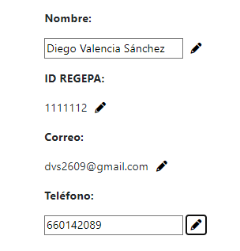

# AGROENLAZADOS

## Descripción del proyecto
Breve descripción del proyecto y su propósito.

## Funcionalidades principales

### Elección de provincia/comunidad para entrar en AgroEnlazados

- Permite a los usuarios seleccionar su provincia o comunidad para acceder a información relevante según su ubicación.

### Login

- Permite a los usuarios iniciar sesión si ya tienen una cuenta en AgroEnlazados

### Registro

- Permite a los nuevos usuarios crear una cuenta en AgroEnlazados. Necesitarán el identificador de REGEPA y el DNI para realizar el registro.

### Inicio y redirecciones de inicio

- Los usuarios son redirigidos a una página de inicio personalizada después de iniciar sesión, registrarse o haber elegido en la pagina inicial la provincia o cumunidad.
- En esta página se proporcionan enlaces rápidos a las siguientes secciones:
    - Cooperativas
    - Productores
    - Ventas
    - Mercadillos

### Tipos de venta

- AgroEnlazados ofrece diferentes tipos de ventas:   
    - Venta de Proximidad   
    - Venta en Ferias, Mercadillos y Mercados ambulantes  
    - Venta en Establecimientos y Tiendas locales
    - Venta en Cooperativas
    - Venta Online

### Tipos de venta
- Desde la pagina de tipos de venta pueden acceder a una página como esta con informacion sobre el tipo de venta:
    
    - Venta de Proximidad
    
    - Venta en Ferias, Mercadillos y Mercados ambulantes

### Navbar

- La barra de navegación (navbar) permite a los usuarios acceder fácilmente a diferentes secciones y funciones del sitio web.
    
    - Navbar pagina de eleccion de provincia, inicio y login
    
    - Navbar en las demas vistas
    
    - Navbar en las demas vistas con usuario logueado

### Filtros para tablas

- Los filtros de tabla permiten a los usuarios refinar sus búsquedas y encontrar información específica relacionada con productos agrícolas, cooperativas, productores, ventas, etc.

### Mapa

- El mapa proporciona una visualización geográfica de las cooperativas de Extremadura. El mapa muestra las cooperativas que aparezcan en ese momento en la tabla.

### Tabla y paginado

- Las secciones de productores, cooperativas y mercadillos se presentan en forma de tabla con paginación para facilitar la navegación y exploración de la información.

### Perfil del productor

- Sin iniciar sesión:
    - Los usuarios pueden ver la información del productor y contactarlo a través de correo electrónico y teléfono.

- Iniciado sesión:
    - Además de ver la información del productor, los usuarios pueden realizar las siguientes acciones en su propio perfil:
        
        - Editar nombre, identificación, correo electrónico, teléfono y código postal.
        
        - Añadir y eliminar productos.
        
        - Añadir dirección y tienda (Se diferencian en que cada modal tiene default el tipo de venta que realiza).
        
        - Editar dirección y tienda. Para facilitar al usuario se insertan todos las variables de ese campo para que sea mas facil la edición.
        
        - Eliminar dirección y tienda.
        
        - Añadir y eliminar ferias y mercadillos.
        
        - Añadir links de webs.
        
        - Ejemplo de encuestaa.

### Footer

- Desde el pie de página el usuario podrá enviar un mensaje comentado sus quejas, sugerencias o reportes.